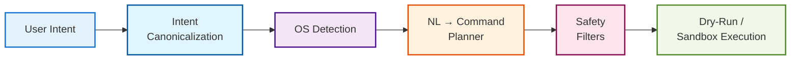

# contAIner  
AI-Driven OS-Level Environment Manager

contAIner is a research-driven system for converting natural-language user intent into
safe, OS-aware shell command plans. The system is designed as a modular agent rather
than a monolithic language model.

The current focus (Step-1) is on intent understanding and command generation.
Environment execution and dependency installation are intentionally deferred.

---

## Motivation

Software environment setup is repetitive, error-prone, and highly platform-specific.
Existing tools rely on manual configuration and lack semantic understanding of user intent.

contAIner aims to:
- Interpret vague user requests safely
- Generate OS-aware shell command plans
- Reduce hallucinations using structured intent and validation
- Provide a foundation for automated environment management

---

## Design Philosophy

- Modular agent, not a single LLM
- Explicit intent representation
- OS awareness as first-class input
- Safety before execution
- Incremental learning from validated outputs

---

## Architecture (High-Level)



---

## Step-1 Scope (Current)

Natural language → intent canonicalization  
Linux and Windows command generation  
Dataset normalization and augmentation  
LLM-based command planning  
Safety validation and CLI testing  

---

## Datasets Used

- NL2Bash  
  Natural language to Bash command corpus

- NL2SH-ALFA  
  Instructions-to-shell dataset  
  https://huggingface.co/datasets/westenfelder/NL2SH-ALFA

- Repository execution traces from prior research

---

## Models

The contAIner system uses a single primary model for command generation.

- **Primary Model:** CodeT5+ (770M)  
  Used for all NL → OS-aware shell command generation due to its strong
  performance on code-oriented tasks and structured output control.

- **Baseline Model:** FLAN-T5 (base)  
  Used only for benchmarking and evaluation.

- **Experimental Model:** Qwen-Coder (QLoRA)  
  Used for exploratory comparison and upper-bound performance analysis.

All models are explicitly conditioned on operating system and shell type
to prevent ambiguity and unsafe command generation.


---

## Evaluation Metrics

- Exact command match
- Normalized command match
- Execution validity (dry-run)

---

## Documentation

Detailed documentation is available in the `docs/` directory:

- [Architecture Diagrams](docs/ARCHITECTURE_DIAGRAM.md) - Visual system architecture with Mermaid diagrams
- [System 1: Intent Understanding](docs/system-1-intent-understanding/README.md) - Intent classification, entity extraction, and decomposition
- [System 2: Command Generation](docs/system-2-command-generation/README.md) - OS-aware command generation and validation
- [Integration Guide](docs/integration/README.md) - System orchestration and deployment architectures
- [Dataset Documentation](docs/datasets/README.md) - Training data sources and schemas


## Repository Structure

```
contAIner/
├── docs/
│   ├── ARCHITECTURE_DIAGRAM.md
│   ├── system-1-intent-understanding/
│   ├── system-2-command-generation/
│   ├── integration/
│   └── datasets/
├── LICENSE
└── README.md
```

---

## License

Apache License 2.0
