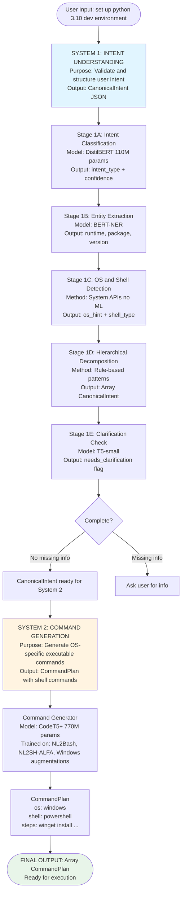
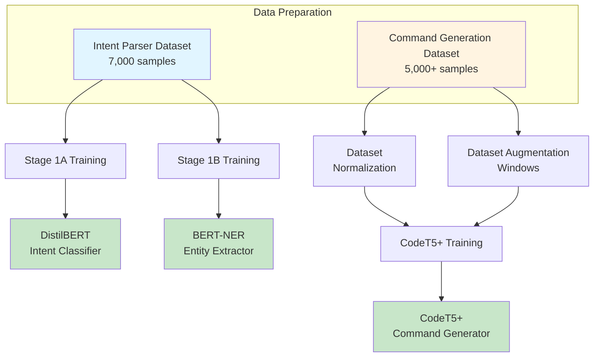
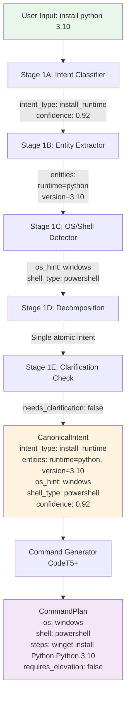
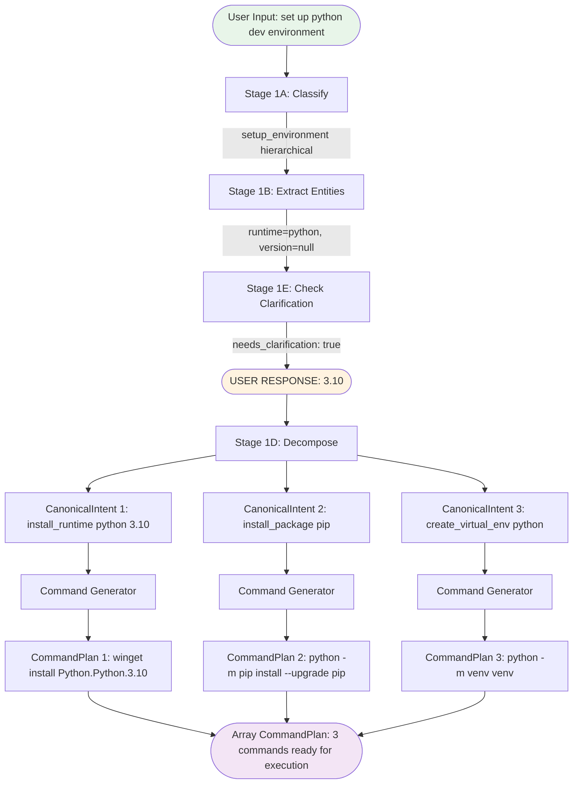
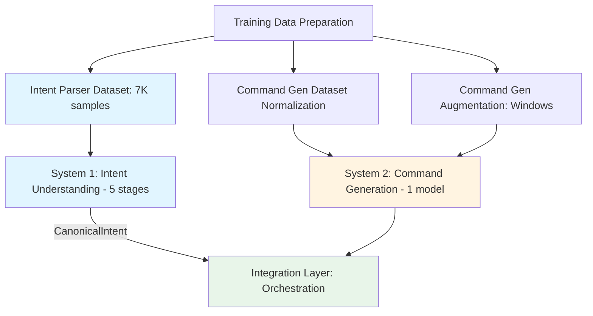
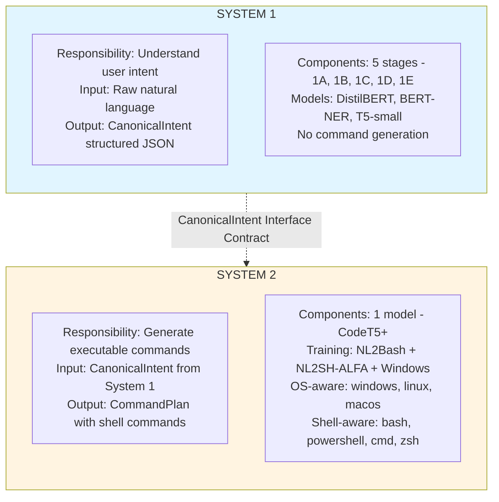
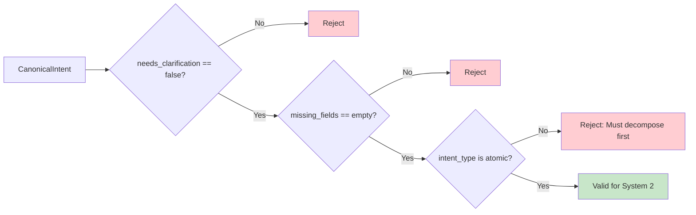

# contAIner Architecture Diagram

## High-Level System Overview



---

## Training Pipeline



---

## Inference Pipeline



---

## Data Flow with Hierarchical Intent



---

## Component Dependencies



---

## System Boundaries



---

## Integration Interface: CanonicalIntent

The **CanonicalIntent** object is the contract between System 1 (output) and System 2 (input).

### Structure

```json
{
  "intent_type": "install_runtime",
  "entities": {
    "runtime": "python",
    "package": null,
    "version": "3.10"
  },
  "scope": "system",
  "os_hint": "windows",
  "shell_type": "powershell",
  "confidence": 0.92,
  "missing_fields": [],
  "needs_clarification": false,
  "clarification_question": null
}
```

### Validation Rules for System 2



**Required Conditions:**
- `needs_clarification` must be `false`
- `missing_fields` must be empty array `[]`
- `intent_type` must be atomic (not hierarchical)
- All required entities must be present (no `null` for mandatory fields)

---

## See Also

- [System 1 Documentation](./system-1-intent-understanding/README.md)
- [System 2 Documentation](./system-2-command-generation/README.md)
- [Dataset Documentation](./datasets/README.md)
- [Integration Guide](./integration/README.md)
