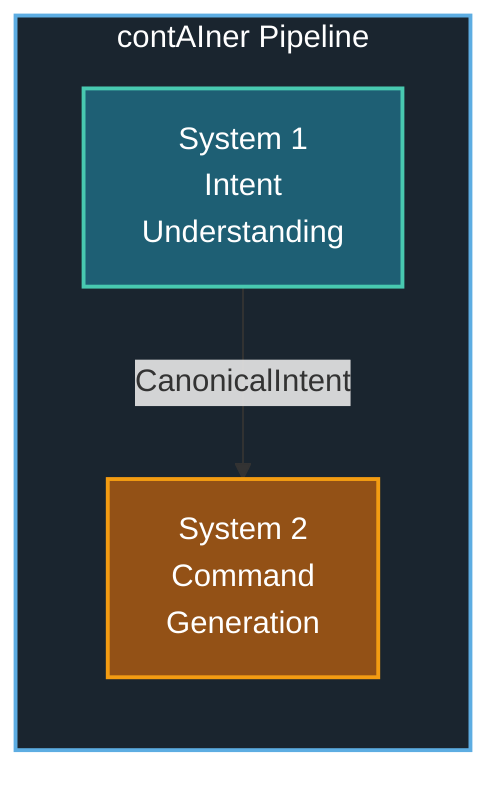
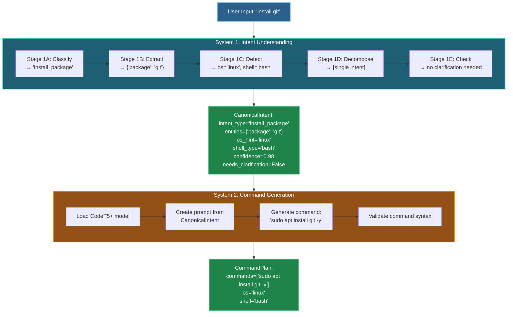
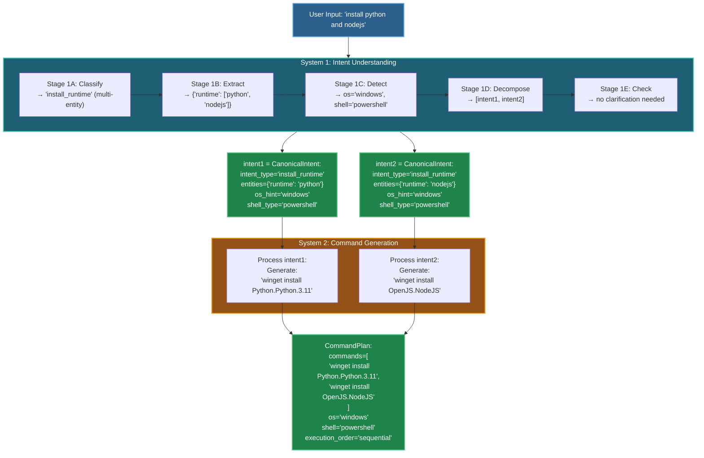

# System Integration Guide

## Overview

This guide explains how **System 1 (Intent Understanding)** and **System 2 (Command Generation)** work together to form the complete contAIner pipeline.

---

## Pipeline Architecture

### Key Interface: CanonicalIntent

System 1 outputs **CanonicalIntent** objects that System 2 consumes.

**Structure**:
- `intent_type`: e.g., "install_package"
- `entities`: Dictionary of extracted entities (package, runtime, version)
- `os_hint`: "windows", "linux", "macos"
- `shell_type`: "powershell", "bash", "zsh", "cmd"
- `confidence`: 0.0 to 1.0
- `needs_clarification`: True if ambiguous
- `missing_fields`: List of unclear fields
- `raw_instruction`: Original user input

---

## End-to-End Flow

### Simple Example: "install git"

### Complex Example: "install python and nodejs"

---

## Orchestration Layer

The orchestration layer coordinates System 1 and System 2:

### Main Functions

**process(user_instruction)**: Main orchestration function
1. Parse intent using System 1
2. Check if clarification is needed
3. If not, generate commands using System 2
4. Return result with commands or clarification questions

**_handle_clarification(intents)**: Generate clarification questions
- Uses System 1 Stage 1E to generate questions
- Returns partial intents with questions for user

### Result Format

On success:
- `success`: true
- `commands`: Array of generated commands
- `original_instruction`: User's input
- `parsed_intents`: Structured intent objects

On clarification needed:
- `success`: false  
- `needs_clarification`: true
- `questions`: Array of clarification questions
- `partial_intents`: Incomplete intent objects

---

## Error Handling

### Strategy 1: Retry with Fallback

- Try System 1 intent parsing
- If fails: Return error message and suggest rephrasing
- Try System 2 command generation
- If fails: Return parsed intent for debugging and suggest manual approach

### Strategy 2: Confidence Thresholding

- Set confidence threshold (e.g., 0.7)
- Check intent confidence after System 1 parsing
- If below threshold: Ask user for confirmation before proceeding
- If confirmed: Continue with System 2 command generation

---

## Performance Optimization

### Batch Processing

Process multiple instructions efficiently:
1. Batch all instructions through System 1
2. Batch all resulting intents through System 2  
3. Package results together

**Benefits**: Reduced overhead, better GPU utilization

### Caching

Cache processed instructions to avoid redundant work:
1. Generate cache key from instruction (MD5 hash)
2. Check cache before processing
3. If hit: Return cached result immediately
4. If miss: Process normally and store in cache

**Benefits**: Faster responses for repeated queries

---

## Testing Integration

### Unit Test: Interface Contract

**Test System 1 Output Format**:
- Parse sample instruction ("install git")
- Verify CanonicalIntent has all required fields
- Check field types and values

**Test System 2 Accepts CanonicalIntent**:
- Get intent from System 1
- Pass to System 2
- Verify command is generated successfully

### Integration Test: End-to-End

**Test Simple Instruction**:
- Process "install git" through complete pipeline
- Verify success status
- Check command contains "git"

**Test Complex Instruction**:
- Process "install python 3.10 and nodejs"
- Verify 2 commands generated
- Check commands contain "python" and "node"

**Test Clarification Flow**:
- Process ambiguous instruction ("install it")
- Verify clarification needed flag
- Check questions generated

---

## Monitoring & Logging

### Logging Strategy

**Log Points**:
- User input received
- System 1 processing start/end with duration
- Parsed intents (debug level)
- Clarification needed (warning level)
- System 2 processing start/end with duration  
- Generated commands (debug level)
- Total pipeline duration

**Metrics to Track**:
- System 1 duration (seconds)
- System 2 duration (seconds)
- Total pipeline duration (seconds)

### Metrics Collection

**Prometheus Metrics**:
- `container_requests_total`: Counter for total requests
- `system1_duration_seconds`: Histogram for System 1 duration
- `system2_duration_seconds`: Histogram for System 2 duration
- `clarification_requests_total`: Counter for clarification requests

**Usage**: Export metrics endpoint for Prometheus scraping

---

## See Also

- [System 1 Documentation](../system-1-intent-understanding/README.md) - Intent understanding details
- [System 2 Documentation](../system-2-command-generation/README.md) - Command generation details
- [Architecture Overview](../ARCHITECTURE_DIAGRAM.md) - Visual architecture diagrams
- [Dataset Documentation](../datasets/README.md) - Training data details
