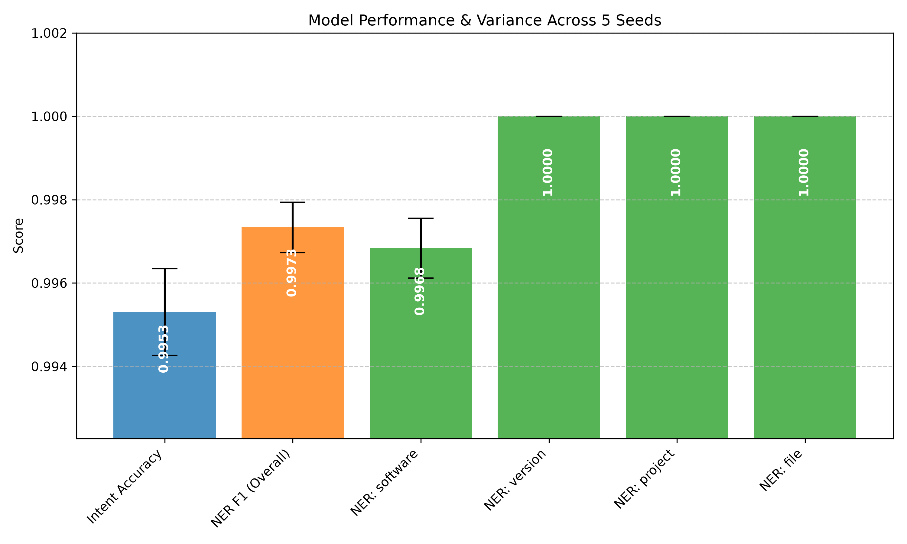

# System 1 Intent & NER Evaluation Results

This document summarizes the validation of the System 1 (DistilRoBERTa) intent classification and NER entity extraction model.

## 1. End-to-End Pipeline Verification

This test verified the live inference path (`System1Predictor`), confirming that the final predicted strings exact-match the expected ground truth entities from `test_corrected.jsonl`.

**End-to-End Exact Match Rate per Entity Type:**
- **software:** 820/829 (98.91%)
- **project:** 69/69 (100.00%)
- **version:** 62/62 (100.00%)
- **file:** 22/22 (100.00%)

The mismatches (mostly spacing artifacts) have been logged to `e2e_mismatches.json`.

## 2. Repeated-Seed Training Variance

To ensure the model is robust and the high scores are not due to an accidental "lucky seed", the model was trained from scratch 5 times with different random seeds (42, 100, 2026, 888, 1234). 

**Overall Metrics (Mean ± Std Dev):**
- **Intent Accuracy**: 0.9953 ± 0.0010
- **NER Precision**: 0.9973 ± 0.0015
- **NER Recall**: 0.9973 ± 0.0026
- **NER F1**: 0.9973 ± 0.0006

**Per-Entity NER F1 (Mean ± Std Dev):**
- **software:** 0.9968 ± 0.0007
- **version:** 1.0000 ± 0.0000
- **project:** 1.0000 ± 0.0000
- **file:** 1.0000 ± 0.0000

The variance is near-zero (exactly zero for low-support classes like `file`), confirming that the training and model architecture are extremely stable.

